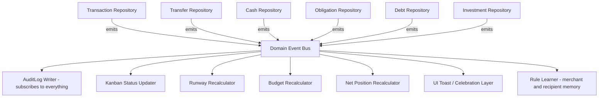

# Sciuro — Automation & Cross-Module Event Architecture
## How Every Module Reacts to Every Other Module, With Minimal Manual Input

> Companion to the v4 engineering plan and the UI/UX plan. This document answers one specific question: when one atomic thing happens (a transaction is confirmed, a recount closes a gap, a price refreshes), what *else* in the app should react automatically — and what mechanism makes that possible without hand-wiring every module to know about every other module.

---

## 1. The Core Idea: Derive, Don't Duplicate

Every automation described below falls out of one architectural decision, so it's worth stating first rather than burying it:

**Sciuro stores almost nothing as mutable current-state. Nearly everything is *derived* from an append-only log of atomic facts.**

You already applied this instinct once, in the v4 Investment module — gold holdings are stored as weight bought/sold, and MYR value is always *computed* fresh from a live price, never stored as ground truth. This document generalizes that same idea across the entire app:

| Stored as ground truth (atomic facts) | Always derived, never stored |
|---|---|
| Confirmed transactions | Account balances |
| TransferLinks | Home runway / safe-to-spend |
| CashAdjustments (recounts) | Budget remaining per category |
| InvestmentTransactions (buy/sell) | Investment value in MYR |
| RecurringObligation confirmations | Debt payoff trajectory |
| Manual corrections | Kanban column membership (it's just `status`, itself derived from the facts above) |
| — | **Net Position** (new concept, Section 7) |

This is *why* cross-module automation is possible at all: if Kanban status, budget totals, and the runway number were each separately stored and separately updated, every new feature would need to remember to update all of them by hand, and they'd eventually drift out of sync with each other. Because they're all computed from the same underlying facts, they can never disagree — and any module that reacts to "a fact changed" automatically stays correct, without needing bespoke sync code per pair of modules.

---

## 2. The Mechanism: Domain Event Bus

This is the concrete answer to "how do modules cross and intertwine": a single **Domain Event Bus** (a `SharedFlow<DomainEvent>`, injected as a Koin singleton) that every module publishes to and any module can subscribe to, without knowing who else is listening.



**How this refines the v4 plan**: Section 5 of the v4 engineering plan proposed a repository wrapper that calls `AuditLog.write()` on every mutation. That's still correct in spirit, but this event bus is the cleaner, more general version of the same idea — the repository wrapper doesn't call `AuditLog` directly, it publishes a `DomainEvent`, and `AuditLog` is simply the one subscriber that listens to *every* event type and writes a record. Kanban, Runway, Budget, and Net Position are just four more subscribers doing the same thing with a narrower filter. One mechanism, five consumers — this is what "intertwined without being tangled" looks like architecturally: no module calls into another module directly, they only ever publish or subscribe to events.

- **Publishing is fire-and-forget** — a repository commits its write, then emits the event, and doesn't wait for or care how subscribers react. This keeps the write path fast and keeps modules genuinely decoupled (Kanban logic changing later can't break Transfer logic, because Transfer never called Kanban directly).
- **Subscribers recompute derived state, they don't get told what the new state is** — e.g., the Runway Recalculator doesn't receive "runway is now RM340," it receives "a RecurringObligation was settled" and recomputes runway from scratch off current data. Slightly more compute, dramatically fewer bugs, since there's only one code path that knows how to calculate runway.

---

## 3. Domain Event Catalog

The actual event types (as a sealed interface) — this is the technical backbone the cascades in Section 4 are built from.

| Event | Emitted by | Key payload |
|---|---|---|
| `TransactionCategorized` | Categorization classifier | transactionId, category, confidence, source |
| `TransactionRecategorized` | User correction (Transaction Detail) | transactionId, oldCategory, newCategory |
| `TransferMatched` | Transfer Matching Engine | transferLinkId, sourceTxId, destTxId, matchMethod |
| `TransferUnmatchedFlagged` | Transfer Matching Engine | transactionId, candidateRecipient |
| `CashCredited` / `CashDebited` | Cash repository (from ATM/deposit detection) | cashAccountId, amount, sourceEvent |
| `CashRecounted` | Recount flow | adjustmentId, variance, adjustmentType |
| `RecurringObligationProposed` | Recurring Detector | obligationId, confidence |
| `RecurringObligationConfirmed` | User one-tap confirm (or auto, see Section 8) | obligationId |
| `ObligationCycleSettled` | Recurring Detector, matching a new transaction against an ACTIVE obligation | obligationId, transactionId |
| `ObligationAmountDrifted` | Recurring Detector, noticing a repeated new amount | obligationId, oldAmount, newAmount |
| `DebtBalanceUpdated` | Debt repository | debtId, newBalance, method |
| `DebtFullyPaidOff` | Debt repository, when balance hits zero | debtId |
| `BnplRiskThresholdCrossed` | Debt repository | activeBnplCount |
| `BudgetThresholdCrossed` | Budget engine | category, percentUsed |
| `BudgetLimitSuggested` | Budget engine, from historical average | category, suggestedAmount |
| `InvestmentTransactionRecorded` | Investment repository | accountId, action, unitAmount |
| `InvestmentPriceRefreshed` | Gold price API poll | accountId, newPricePerUnit |
| `IncomeRecurrencePatternDetected` | Recurring Detector, on income-side transactions | incomeStreamId, expectedNextDate |
| `NewFinanceAppDetected` | Package-install observer | packageName |
| `MerchantRuleLearned` | Rule Learner subscriber | merchant, category |
| `RecipientRuleLearned` | Rule Learner subscriber | accountRef, classification |

---

## 4. Cross-Module Cascade Catalog

This is the direct answer to "brainstorm more instances like the bill-payment example." Each row is one atomic event and everything it sets off — this is where "intertwined" becomes concrete.

### 4.1 Your example, made precise: Bill payment settles a Kanban card

```mermaid
sequenceDiagram
    participant Bank as Bank Notification
    participant Parser as Parser/Classifier
    participant Obl as Recurring Obligation Detector
    participant Bus as Domain Event Bus
    Bank->>Parser: "RM68.00 debited - Maxis"
    Parser->>Obl: matches ACTIVE obligation "Maxis Postpaid"
    Obl->>Bus: emit ObligationCycleSettled
    Bus->>Kanban: card moves Due Soon to Settled
    Bus->>Budget: Telco category spend +RM68
    Bus->>Runway: Maxis no longer in "upcoming" subtraction until next cycle
    Bus->>AuditLog: record written
    Bus->>UI: if Kanban open, card animates; else silent
```

### 4.2 Everything else that behaves the same way

| Trigger | Cascading reactions | Manual step it removes |
|---|---|---|
| **Loan installment detected** (PTPTN/car/personal) | `ObligationCycleSettled` → Kanban settles → **also** `DebtBalanceUpdated` (linked debt) → payoff trajectory recalculates → if final installment, `DebtFullyPaidOff` → celebration moment fires | Never having to mark a loan payment or manually reduce a balance |
| **ATM withdrawal** | `CashCredited` on the Cash account (auto, `AUTO_ATM` match method) → Wallet balance updates → Runway unaffected (money moved, not spent) → account row pulses on Home if open | Manually logging "I withdrew cash" |
| **Cash deposit into bank** | One-tap confirm → `CashDebited` → Wallet balance corrects → Runway reflects the corrected cash figure | Manually reconciling a deposit against the wallet |
| **Bank-to-bank self-transfer matched** | `TransferMatched` → both legs tagged TRANSFER → both account balances update → **both excluded from budget/category totals** → Runway unaffected (net zero across your own accounts) → both rows pulse simultaneously on Home | Manually excluding a transfer from your spending analysis |
| **Cash recount reveals a shortage** | `CashRecounted` → Cash balance corrects → Runway recalculates the cash portion → **explicitly does not touch any spend category** → Adjustments log entry appears on Wallet | Manually figuring out "what did I even spend that RM20 on" |
| **New recurring obligation confirmed** | `RecurringObligationConfirmed` → new Kanban card appears in the right column based on next expected date → Home's "next 3 bills due" strip re-evaluates whether it now belongs there → **Runway's forward projection updates**, since future safe-to-spend calculations now account for it | Manually adding a bill to a budgeting tool, ever |
| **BNPL purchase pushes active-plan count to 3+** | `BnplRiskThresholdCrossed` → `StatusPill` risk flag appears on Debt Overview → Kanban gets new installment cards for the new plan | Manually tallying how many BNPL plans are currently open |
| **Category budget threshold crossed (80%/100%)** | `BudgetThresholdCrossed` → `StatusPill` color shifts on both Budgets and the relevant Category Drilldown screen → optional system notification if opted in | Manually checking "am I close to my limit" |
| **Investment price refresh (gold)** | `InvestmentPriceRefreshed` → Investment tile value count-animates to new figure → **Net Position recalculates** (Section 7) since it rolls up investment value automatically | Manually recalculating your net worth whenever gold prices move |
| **A merchant is categorized for the first time via Review Inbox** | `MerchantRuleLearned` → every *future* transaction from that merchant auto-categorizes at high confidence, permanently, without going to Review Inbox again | Manually recategorizing the same merchant every single month, forever |
| **A transfer recipient is confirmed as "me" for the first time** | `RecipientRuleLearned` → future transfers to/from that same account auto-match without prompting, after 2–3 confirmations build confidence | Manually confirming the same cross-bank transfer pattern every time it recurs |
| **A subscription's amount changes and repeats** (e.g., Netflix price increase) | `ObligationAmountDrifted`, but only after the *new* amount is seen twice — a single deviation is treated as a possible anomaly and routed to Review, a *repeated* new amount updates `expectedAmount` automatically | Manually noticing and updating a bill amount after a price change |
| **Income lands on a recognizable recurring pattern** | `IncomeRecurrencePatternDetected` → `expectedNextDate` populates → this directly feeds the Runway calculation's "obligations due before next income" window, which until now had no defined source for that date | Manually telling the app when your next paycheck/stipend is expected |
| **A new bank or e-wallet app is installed on the device** | `NewFinanceAppDetected` → a one-tap suggestion surfaces ("Noticed Boost is installed — track it?") rather than requiring a trip into Settings | Manually finding and enabling notification capture for a new app |

---

## 5. The Meta-Pattern: Confirmations Become Standing Rules

Several rows above share the same underlying idea, worth naming explicitly since it's the single highest-leverage automation principle in the whole app:

**Every manual confirmation should teach the system something permanent, not just resolve the one instance in front of you.**

- Confirming a merchant's category once → that merchant never needs confirming again (`MerchantRuleLearned`).
- Confirming a transfer recipient is "you" once or twice → that account pair never needs confirming again (`RecipientRuleLearned`).
- Confirming a new recurring obligation once → it's tracked forever, no re-confirmation each month.

The design implication: **Review Inbox items are not just tickets to close, they're training data.** Every screen that asks a one-tap question should be built with this in mind from the start — the question being asked matters less than what gets written to a rule table as a side effect of answering it. This is also why the manual-input curve should trend toward zero over the first month or two of real use, rather than staying flat — a well-built Review Inbox gets *quieter* over time, not just individually resolved.

---

## 6. Manual Input Audit (Full Inventory)

Every remaining point of manual interaction across the app, and what happens to it.

| Touchpoint | Where | Automation strategy | Residual manual input |
|---|---|---|---|
| Confirm new recurring obligation | Kanban / inline card | One-tap now; category-wide auto-confirm-with-undo once a pattern type has proven reliable across many prior detections (tunable, off by default — see Section 8) | Trending toward zero |
| Low-confidence categorization | Review Inbox | `MerchantRuleLearned` (Section 5) | Approaches zero as merchant coverage grows |
| Unmatched transfer resolution | Review Inbox | `RecipientRuleLearned` (Section 5) | Approaches zero per relationship |
| Debt balance anchor (PTPTN, car loan) | Debt Overview | Smart nudge timing — only prompt when the installment count implies the balance should have moved, not a blind calendar reminder; future: statement parsing once the scaffolded Email adapter (v4 Section 6) is built | Manual until email ingestion exists; minimized meanwhile |
| Cash recount | Wallet | Smart nudge timing based on drift-likelihood (time since last recount × number of ATM withdrawals since), not a fixed schedule | Irreducible by nature — it's a physical reality check, but *when* you're asked is optimized |
| Cash spend logging | Wallet | Optional, de-emphasized by design | Irreducible without a digital trace — intentionally left optional rather than forced |
| Informal debt entry | Debt Ledger | Minimal 3-field form; stretch idea — flag a *suggested* informal-debt entry if a DuitNow transfer note contains repayment-related wording, for the user to confirm or dismiss | Mostly irreducible, but a suggestion can shortcut the typing |
| Budget limit setting | Budgets | `BudgetLimitSuggested` — auto-proposes a limit from 2–3 months of historical average per category, one-tap accept | One-tap, first time only, per category |
| Investment buy/sell entry | Investment | Routed through the normal parser pipeline if Maybank sends GIA notifications; manual otherwise | Manual only where no notification exists — acceptable given how infrequent these actions are |
| Notification allowlist setup | Settings/onboarding | `NewFinanceAppDetected` proactively suggests newly installed finance apps | One-tap accept per new app, instead of manual settings navigation |
| LLM opt-in toggle | Settings | Deliberately not automated — a privacy-relevant choice deserves explicit, once-off consent | Intentionally manual |
| Category correction | Transaction Detail | Rare, and each correction feeds `MerchantRuleLearned` | Naturally decreases over time |

---

## 7. New Derived Concept: Net Position

A direct payoff of the "derive, don't duplicate" principle (Section 1) — worth introducing explicitly since it wasn't in earlier versions of the plan and falls out naturally once every module publishes events to the same bus.

```
NetPosition (fully computed, never stored)
= Σ(bank account balances)
+ Σ(e-wallet balances)
+ Cash balance
+ Σ(investment values, at current price)
− Σ(debt outstanding balances)
```

- Recalculated by a subscriber that reacts to *any* event that could plausibly change one of its inputs (`TransactionCategorized`, `TransferMatched`, `CashCredited/Debited`, `DebtBalanceUpdated`, `InvestmentPriceRefreshed`) — it doesn't need bespoke wiring per source, it just recomputes the sum whenever anything upstream changes, because it was built as a pure function over current data rather than an incrementally-updated running total.
- Surfaced as a small, secondary figure on Home (below the runway number, which stays the primary glanceable metric) or as its own card one tap away — a nice-to-have addition to Section 11 of the UI/UX plan, not a required v1 screen, but essentially free to add once this architecture exists.

---

## 8. Proactive Automation Ideas (Brainstormed, Beyond What Was Asked)

A few further-out ideas surfaced by thinking through the event architecture — flagged as ideas to consider, not committed scope:

- **Confidence-graduated auto-confirm.** Right now every new recurring obligation gets a one-tap confirm regardless of how obvious it is. Once a *category* of pattern (e.g., "monthly telco bill, same amount ±5%, same day ±2") has been correctly detected and confirmed by you many times over, that category of detection could graduate to auto-confirm-with-undo — it creates the obligation silently and shows an undo-able toast instead of asking first. This should be opt-in and tunable per category, not a silent global behavior change, since trust in automation should be earned deliberately, not assumed.
- **Anomaly-aware remark prompts.** When a Cash Recount variance is unusually large relative to your typical drift, the remark field could go from optional to lightly encouraged ("This is a bigger gap than usual — anything to note?") — not blocking, just a nudge, since a big unexplained shortage is exactly the kind of thing worth having a note attached to later.
- **Runway-aware quiet hours.** Since "silence by default" is already a principle, the *timing* of any opted-in notifications (budget threshold, bill due soon) could itself be runway-aware — e.g., don't surface a "you're close to your Shopping budget" nudge on a day when the runway number is already healthy and climbing, since it's low-value information at that moment. Purely a polish idea, not required for v1.
- **Recurring detection applied to income, not just bills.** Already captured as `IncomeRecurrencePatternDetected` in the event catalog (Section 3) — worth calling out again here because it closes a real gap: earlier versions of the plan referenced "next expected income date" as an input to the runway calculation without ever specifying where that date comes from. This event is the answer, and it means the runway number gets *more* accurate over time as your income pattern is observed, with zero setup.

---

## 9. Where This Fits Into the v4 Phase Plan

The Domain Event Bus is foundational infrastructure, not a Milestone C polish item — it needs to exist before most of Milestone A/B can be built the way this document describes, since the cascades depend on it.

| This document's work | v4 phase |
|---|---|
| Domain Event Bus + sealed `DomainEvent` catalog (Sections 2–3) | **Phase A1**, built alongside (or just before) the Audit Log core — they're two views of the same mechanism, so building them together avoids doing the AuditLog wiring once procedurally and then again as an event subscriber later |
| Rule Learner subscriber (`MerchantRuleLearned`, `RecipientRuleLearned`) | **Phase A6** (Actor-Critic Triage & Categorization) — this is where merchant/recipient memory was already planned, now formalized as event-driven |
| Kanban/Runway/Budget recalculation subscribers | Each lands alongside its owning phase (**B1** obligations, **B3** reconciliation, **B7** budgeting) — but should be written as bus subscribers from the start rather than direct procedural calls, so later modules (Net Position) can plug in without touching earlier code |
| Net Position (Section 7) | New, small addition — fits cleanly at the end of **Milestone B** once all its inputs (bank, cash, e-wallet, debt, investment) exist |
| Proactive automation ideas (Section 8) | Deferred / **Milestone D or post-MVP** — genuinely optional polish, correctly sequenced after the core loop is trustworthy, consistent with the dogfood-first checkpoint already established in v4 |

---

## 10. Immediate Next Steps

1. Define the `DomainEvent` sealed interface (Section 3) in code early — even before the modules that emit specific events are built, since agreeing on the shape of events now prevents rework later.
2. Build the Domain Event Bus itself and the AuditLog subscriber together as Phase A1's first deliverable — this is the same recommendation as the v4 plan, just now explicit that it's an event-driven implementation rather than a direct-call wrapper.
3. When each subsequent module (obligations, transfers, budgets, investment) is built, write its cross-module reactions as bus subscriptions from day one — retrofitting procedural code into event subscribers later is real, avoidable rework.
