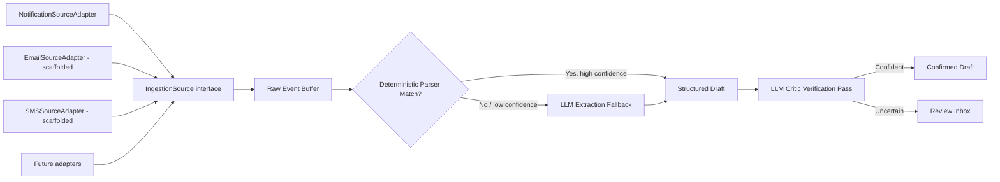
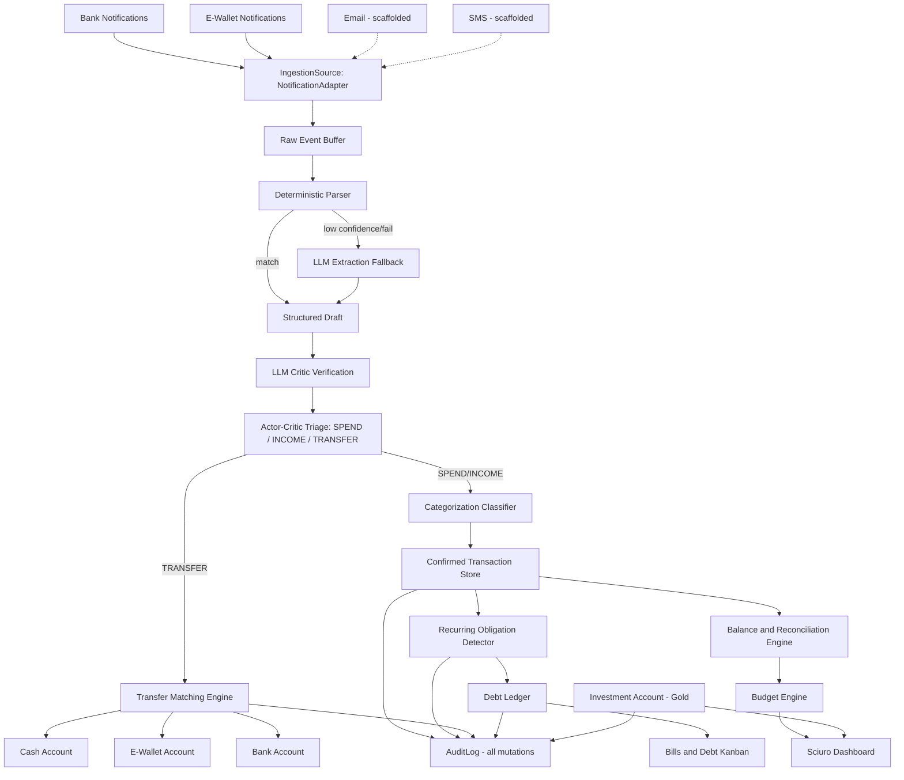

# Sciuro — Implementation Plan v4
## Engineering Standards, Auditability, Multi-Source LLM Parsing, E-Wallets & Investment Tracking

> Builds on v3 (Malaysian payment channels, physical wallet, transfer detection). v4 adds: Sprint-grade engineering discipline, a `development_documentation/` paper trail, per-functionality test cases, full auditability, a generalized multi-source ingestion pipeline with LLM-assisted parsing, a clarified cross-module Kanban role, full e-wallet integration, and a gold savings/investment module. It also folds in the external review you received and responds to each point directly.

---

## 1. Response to the External Review

The review was sound and is incorporated throughout this plan. Point-by-point:

| Review concern | Response in v4 |
|---|---|
| Parser fragility, format drift, silent breakage | Regression fixture suite starts in the parser phase, not at the end (Section 6). Graceful degradation: failed field extraction never blocks a transaction — it still books with partial data and routes to Review. |
| Transfer matching false positives/negatives | Matching window is conservative and tunable (default ±2h, not ±24h), name matching is fuzzy not exact, and **any new cross-account pattern is always routed to Review Inbox the first time** before Sciuro is allowed to auto-match it again. |
| Timeline compression (Phase 2, Phase 11 in v3) | Explicit 0.5–1 wk buffers added after the two highest-variance phases (see Section 12 timeline). |
| E-wallet reload as a blind spot | Resolved structurally, not just disclaimed — e-wallets are now a fully ingested account type (Section 8), using the same notification pipeline as banks. |
| Windows desktop sync mechanism undefined | Cut from MVP scope. Deferred to a clearly-scoped future phase with sync mechanism to be decided then (manual encrypted export first, anything richer is its own project). |
| Malay-language notification variants | Explicit requirement added to parser sample collection (Section 6) — every bank/wallet needs at least one English and one Bahasa Malaysia sample where the device locale could produce either. |
| No cloud backup / lost-phone risk | Encrypted manual export flow added to the security phase — not automatic cloud sync (keeps local-first promise), but an explicit escape hatch. |
| Split transactions not modeled | Flagged as a known future gap; data model leaves room for it (Section 10) but it is not built in v4. |
| Multi-currency | Explicitly out of scope — noted, not solved. |

---

## 2. Engineering Foundations (Sprint-Grade Discipline)

The goal is that Sciuro can survive months of intermittent part-time work without rotting — the same standard Sprint holds itself to.

- **Clean, layered module structure** (KMP): `core-ingestion`, `core-parsing`, `core-llm`, `core-classifier`, `core-ledger`, `core-audit`, `core-obligations`, `core-transfer`, `core-investment`, `feature-dashboard`, `feature-kanban`, `feature-wallet`, `feature-budgets`. Each `core-*` module has no dependency on any `feature-*` module — this is what keeps the domain logic testable and reusable if the UI layer changes later.
- **Dependency injection**: Koin over Hilt for this project specifically, since Hilt is Android-only and Sciuro is KMP from day one (Windows desktop is on the eventual roadmap). This is a deliberate deviation from your existing Android-only Hilt habit — worth flagging so it's a conscious choice, not an inconsistency.
- **Repository + use-case pattern**: UI never talks to SQLDelight directly. Every mutation goes through a repository, and every repository write is wrapped by the audit-logging layer (Section 5) automatically — so auditability isn't something each feature has to remember to implement.
- **Static analysis & CI hygiene**: detekt/ktlint on every commit, a pre-commit hook, and a minimal CI pipeline (even a local GitHub Actions workflow) that runs lint + unit tests before anything is considered "done" for a phase.
- **Schema migrations are versioned from the first commit** — SQLDelight migration files checked in alongside schema changes, never hand-edited in place.
- **Tunable heuristics live in config, not hardcoded** — the transfer-matching window, confidence thresholds for auto-categorization, and recurring-detection occurrence counts are all named constants in a single config object, so tuning them later (as the review suggested) doesn't mean hunting through code.

---

## 3. `development_documentation/` — The Paper Trail

A folder at the repo root, one subfolder per phase, written *as* the phase happens — not retrospectively.

```
development_documentation/
├── INDEX.md                     (running table of contents + phase status)
├── CHANGELOG.md                 (chronological, human-readable)
├── decisions/
│   └── ADR-001-koin-over-hilt.md, ADR-002-sqldelight-over-room.md, ...
└── phase-00-foundations/
    ├── PROBLEMS.md              (what went wrong, honestly)
    ├── FIXES.md                 (what resolved it, and why that approach)
    ├── FEEDBACK.md              (retrospective — scope creep, wrong assumptions, what you'd do differently)
    └── TEST_NOTES.md            (what was tested, what was deliberately skipped and why)
```

- **ADRs (Architecture Decision Records)** are the one addition beyond what you asked for — short, dated documents capturing *why* a non-obvious choice was made (e.g., "why Koin over Hilt," "why the transfer window is 2 hours not 24"). Six months from now, this is what stops you from re-litigating a decision you already made for a good reason.
- **PROBLEMS.md is honest by design** — the instruction to keep "honest feedback" only works if the format doesn't pressure you to make each phase look clean. A phase that took twice as long because BSN's notification format turned out to have three undocumented variants is exactly the kind of thing this folder exists to capture.
- **INDEX.md** stays a single glanceable file — phase name, status (not started / in progress / done / revisited), and a one-line summary, so the whole documentation set is navigable without opening every folder.

---

## 4. Test Strategy (Per-Functionality, Tiered)

Not everything deserves the same rigor — the plan tiers it explicitly so "nice to have" doesn't quietly mean "never."

| Tier | Scope | Requirement |
|---|---|---|
| **Mandatory — financial correctness** | Parsing, triage, transfer matching, balance calculation, audit log integrity, recurring detection | Unit + integration tests required before a phase is marked done. Fixture-based (real anonymized notification samples) for parsers specifically. |
| **Mandatory — data integrity** | Every repository write path, migration correctness | Integration tests against an in-memory SQLDelight instance. |
| **Nice to have — UX/presentation** | Kanban rendering, dashboard layout, animations | Manual test checklist per screen, documented in `TEST_NOTES.md`; automated Compose UI tests only where they're cheap to add, not a blocking requirement. |
| **Nice to have — edge/rare paths** | Informal debt entry, gold account manual buy/sell, cash recount with zero variance | Smoke-tested manually during dogfooding, not a dedicated suite. |

Each phase's `TEST_NOTES.md` in `development_documentation/` records which tier applied and what was actually covered — so gaps are visible and intentional, not silent.

---

## 5. Auditability — Core Architecture Principle

Every transaction, categorization change, transfer match, recurring-obligation edit, budget adjustment, debt update, and investment buy/sell is recorded — not just the current state, but the history of how it got there.

```
AuditLog
├── id: UUID
├── entityType: enum(TRANSACTION, RECURRING_OBLIGATION, DEBT, TRANSFER_LINK,
│                    CASH_ADJUSTMENT, BUDGET, INVESTMENT_ACCOUNT, EWALLET_ACCOUNT)
├── entityId: UUID
├── action: enum(CREATE, UPDATE, DELETE, RECLASSIFY, MATCH, UNMATCH)
├── beforeState: JSON?  (null for CREATE)
├── afterState: JSON?   (null for DELETE)
├── source: enum(SYSTEM_AUTO, USER_MANUAL, LLM_INFERRED)
├── confidence: Float?  (populated when source == LLM_INFERRED)
└── timestamp: Instant
```

- **Append-only, never mutated or deleted** — corrections are new AuditLog rows, not edits to old ones. This is what makes "auditability" actually mean something rather than just being a log line.
- **Implemented once, at the repository layer** (Section 2) — individual features never call `AuditLog.write()` directly; the repository wrapper does it automatically on every mutation, so it's structurally impossible to add a new feature that forgets to log.
- **Surfaced in the UI**: any transaction, debt, or obligation can be tapped through to a simple history view — "categorized as Food & Dining (auto, 94% confidence) → recategorized as Transport (you, 2 days later)." This also makes the app more trustworthy day-to-day, not just compliant in principle.
- This module is built early (Phase 2 in Section 12) specifically because everything after it needs to write through it — retrofitting audit logging after the ledger already exists is far more painful than building it first.

---

## 6. Multi-Source Ingestion & LLM-Assisted Parsing

Today's sources are bank and e-wallet notifications. You correctly flagged that future sources (email confirmations, SMS for banks that don't push app notifications, potentially messaging apps for peer-to-peer arrangements) aren't fully foreseeable — so the ingestion layer is built as a pluggable abstraction from the start, not hardcoded to notifications.



- **`IngestionSource` interface**: `NotificationSourceAdapter` is fully built in v4 (covers banks + e-wallets, Section 8). `EmailSourceAdapter` is **deferred** (direct email API not yet needed — `AggregatorForwardMatcher` handles forwarded emails via notification interception). `SmsSourceAdapter` is **fully implemented** in Phase G1 with `SmsReceiver` BroadcastReceiver for financial SMS capture.
- **Hybrid parsing, not LLM-only**: deterministic regex/template parsers remain the fast path — free, offline, instant, and what most transactions hit. The LLM is the fallback and the verifier, not the primary engine:
  - **Fallback**: when a regex parser fails to match (new bank format, unfamiliar wallet, an unforeseen source), an LLM extraction call attempts structured extraction (amount, direction, channel, merchant, account) from the raw text — this is what makes the pipeline resilient to format drift without a code change every time a bank tweaks wording.
  - **Critic/verification**: even on a successful regex match, borderline cases (ambiguous channel, merchant name that doesn't match any known pattern, amount that's an outlier for that merchant) get a second LLM pass to sanity-check the extraction before auto-confirming — same actor-critic philosophy as the categorization classifier, applied one layer earlier.
  - **Never hard-fails**: if both regex and LLM extraction come back low-confidence, the transaction still books with whatever partial data exists (amount is nearly always extractable even when everything else isn't) and routes to Review Inbox — directly addressing the review's "fail gracefully" point.
- **On-device vs. cloud tradeoff**: regex path stays fully on-device (no network, no data leaves the phone). LLM fallback/critic calls necessarily leave the device — this should be an explicit, visible setting ("Use AI to improve parsing accuracy — sends transaction text to \[provider] when needed"), off by default or opt-in, consistent with the local-first principle established back in v1.

---

## 7. Kanban — Clarified Cross-Module Role

Kanban in Sciuro is **a rendering pattern over existing status fields, not a separate data structure.** This matters architecturally: if the Kanban board owned its own state, you'd end up with two sources of truth (the entity's real status, and whatever column it's sitting in) drifting apart. Instead:

- A generic `StatusKanbanBoard` UI component takes any list of entities that expose a `status` enum and a small set of allowed transitions, and renders them as columns — built once in `feature-kanban`, reused everywhere.
- **Bills & Debt Board**: columns Upcoming / Due Soon / Settled, driven directly by `RecurringObligation.status` and `Debt` installment status. Bank-linked cards move automatically when a matching notification is confirmed; informal debt cards move on manual tap.
- **Review Inbox, as an alternate Kanban view**: instead of (or alongside) the flat swipe-list from v2/v3, the Review Inbox can render as a board — To Triage / In Review / Resolved — using the same `StatusKanbanBoard` component. This is optional polish, not required for MVP, but costs almost nothing once the generic component exists.
- **What Kanban is *not* used for**: it's not a data entry mechanism (you don't drag a card to "create" a transaction) and it's not used for the Investment or Wallet screens, which are numeric/trend-based, not state-machine-based — Kanban only fits where an entity genuinely moves through discrete states over time.

---

## 8. E-Wallet Integration (Full, Notification-Based)

Extending the same `NotificationSourceAdapter` pattern used for banks — no new architecture needed, just new allowlisted packages and new `ParserRule` sets.

- **In scope**: Touch 'n Go eWallet, GrabPay, Boost, ShopeePay — allowlist their package names alongside CIMB Clicks/Maybank2u/BSN in the `NotificationListenerService`.
- **New account type**: `EWalletAccount` (id, provider, balance) — a peer to `CashAccount` and the bank `AccountBalance` entities.
- **Transaction flow**:
  - **Reload from bank** → already modeled as a TRANSFER in v3 (Section 2.5/2.7); now it has a real destination leg instead of a dead end — the e-wallet's own reload-received notification becomes the matched destination transaction, closing the loop properly instead of just booking an outflow from the bank side.
  - **E-wallet spend** (DuitNow QR via TNG, GrabPay ride payment, Boost merchant payment) → captured directly from the e-wallet app's own notification, categorized like any other SPEND. This is what closes the blind spot the review flagged — you're no longer guessing that a reload became spending, you're seeing the actual spend event.
  - **Cashback/rewards credited to the e-wallet** → routes to Income (Passive/other income, Section 2.1 taxonomy from v2).
- **More sophisticated approaches considered and deliberately not used**: reading e-wallet balance via Accessibility Service (screen-scraping the app's UI) was considered per your "more sophisticated approach if possible" — not recommended. It's fragile against UI updates, carries the same ToS risk profile flagged for bank scraping back in the original viability assessment, and notification-based capture already gets full transaction-level detail (better than a balance snapshot would). Stick with the same pattern that's already working for banks.

---

## 9. Investment / Gold Savings Module

Modeling Maybank's Gold Investment Account (GIA), generalized enough to extend to other asset-type accounts later (unit trust, ASB, etc.) without a redesign.

**Key design decision, matching what you asked for**: the ledger's source of truth is **quantity** (grams of gold bought/sold), not MYR value. Value is always a *derived, computed* field — refreshed on demand against a live gold price — never stored as ground truth. This is the right call because it means a stale price feed never corrupts your actual holdings record; worst case, the displayed value is temporarily wrong, but the weight ledger stays correct.

```
InvestmentAccount
├── id: UUID
├── provider: String  (e.g. "Maybank GIA")
├── assetType: enum(GOLD, UNIT_TRUST, OTHER)
├── unitType: enum(GRAMS, UNITS)
└── unitBalance: BigDecimal   (running total, adjusted by InvestmentTransaction entries)

InvestmentTransaction
├── id: UUID
├── accountId: UUID
├── action: enum(BUY, SELL)
├── unitAmount: BigDecimal        (grams bought/sold)
├── pricePerUnitAtTransaction: BigDecimal   (MYR, recorded at the time — historical record, not live)
├── transactionValue: BigDecimal  (unitAmount × pricePerUnitAtTransaction, for the funding-source ledger entry)
└── timestamp: Instant
```

- **Entry source**: if Maybank sends a notification for GIA buy/sell confirmations, route it through the same parser pipeline as everything else (Phase 6, Section 12). If not (GIA transactions may not always trigger a push notification the way regular banking does), manual entry is acceptable here — these are deliberate, infrequent, considered actions, not the kind of high-frequency spend that "minimal interaction" is meant to protect against.
- **Valuation (presentation layer only)**: current value = `unitBalance × currentGoldPricePerGramMYR`, fetched from a gold price API and refreshed on-demand (app open) or on a light periodic schedule, not real-time streaming — this is a savings account, not a trading terminal. Real, working options exist for a MYR-per-gram feed: services like Gold Price MY / GoldPriceZ / goldbroker.com convert LBMA/COMEX spot prices to MYR per gram in near-real time, and there are paid API providers (e.g. metals-api-style services) if you want a stable, rate-limited endpoint rather than scraping a public price page.
- **Important caveat to surface in the UI**: Maybank's actual GIA buy/sell rate includes the bank's own spread and is not identical to the public spot-converted price — so the computed valuation is a close *estimate* of what you'd get, not the exact redemption value. Worth a small disclaimer on the Investment screen, the same honesty principle as the e-wallet spending disclaimer from the earlier review.
- **Where it sits in the app**: a new Investment tile on the Home dashboard (weight held + estimated value, in the same glanceable spirit as the runway number), with its own drilldown screen showing the buy/sell history and a simple value-over-time chart (weight is flat between transactions; the chart line moves only because price moves — worth labeling clearly so it doesn't look like "the app is guessing your balance").

---

## 10. Consolidated Data Model Additions (v4)

Builds on the v3 model (Transaction, TransferLink, CashAccount, CashAdjustment, RecurringObligation, Debt) with:

```
AuditLog            → Section 5
EWalletAccount       → Section 8
InvestmentAccount    → Section 9
InvestmentTransaction → Section 9

Transaction (further extended)
├── ...v3 fields...
├── sourceAdapter: enum(NOTIFICATION, EMAIL, SMS, MANUAL)   // which IngestionSource produced it
├── extractionMethod: enum(REGEX, LLM_FALLBACK, MANUAL)
└── llmConfidence: Float?   // populated when extractionMethod != REGEX
```

**Known, deliberately deferred gap**: split transactions (e.g., "RM80 dinner, RM60 was my share") have no dedicated model in v4. A future `splitOf: UUID?` field on Transaction, pointing to a parent transaction with a `SplitShare` child table, is the anticipated shape — noted here so the schema isn't accidentally designed in a way that blocks it later, without committing to building it now.

---

## 11. Updated Architecture Diagram



---

## 12. Milestone-Based Phased Plan (v4)

Restructured into milestones, per the review's advice to ship and dogfood the core ledger loop before building the experience layer.

### Milestone A — Engineering Foundation & Ledger Integrity Core
*Goal: a trustworthy, auditable, tested core that captures and correctly classifies real transactions. No dashboard yet.*

| Phase | Content | Duration |
|---|---|---|
| A0 | Engineering foundations: module structure, Koin DI, detekt/ktlint, CI scaffold, SQLDelight + migrations, `development_documentation/` scaffold, test-tier strategy | 1–1.5 wk |
| A1 | Audit Log core + repository-wrapper pattern (built before anything else writes data) | 0.5–1 wk |
| A2 | Ingestion framework: `IngestionSource` abstraction, `NotificationSourceAdapter`, allowlist banks + e-wallets, staging buffer | 1 wk |
| A3 | Bank & e-wallet parsers (CIMB, Maybank, BSN, TNG, GrabPay, Boost, ShopeePay) — fixture regression suite from day 1, English + Bahasa Malaysia samples | 2–2.5 wk (+0.5 wk buffer) |
| A4 | LLM-assisted fallback + critic verification layer | 1–1.5 wk |
| A5 | Financial taxonomy & full data model (incl. EWalletAccount, InvestmentAccount stubs) | 0.5–1 wk |
| A6 | Actor-critic triage (SPEND/INCOME/TRANSFER) + categorization | 1–1.5 wk |

**Milestone A subtotal: ~8–10 weeks**

### Milestone B — Financial Intelligence
*Goal: obligations, debt, transfers, and investment tracking all correctly derived from the core ledger.*

| Phase | Content | Duration |
|---|---|---|
| B1 | Recurring obligation & debt auto-detection | 1–1.5 wk |
| B2 | Transfer detection (conservative window, fuzzy match, first-time-always-review rule) + Cash/E-Wallet wallet matching | 1.5–2 wk (+0.5 wk buffer) |
| B3 | Balance & reconciliation engine (bank + cash + e-wallet) | 0.5–1 wk |
| B4 | Manual Review Inbox (list or Kanban view) | 0.5–1 wk |
| B5 | Debt Ledger module | 1 wk |
| B6 | Investment/Gold Savings module (weight-based ledger + price API valuation) | 1–1.5 wk |
| B7 | Budgeting logic | 1 wk |

**Milestone B subtotal: ~7–9 weeks**

**→ Dogfood checkpoint here, per the review's advice**: run Milestone A+B against your real accounts for 1–2 weeks before touching the experience layer. If the core loop (capture → classify → reconcile → audit) isn't trustworthy, no dashboard fixes that.

### Milestone C — Experience Layer
*Goal: the Sprint-style enhanced UX — glanceable, minimal-interaction, visually coherent.*

| Phase | Content | Duration |
|---|---|---|
| C1 | Generic `StatusKanbanBoard` component + Bills & Debt board | 1 wk |
| C2 | Home dashboard (runway calculation, transfer-aware) + Wallet screen + Investment tile | 1.5–2 wk (+0.5 wk buffer) |
| C3 | Category Drilldown, Investment drilldown, Debt Overview screens | 1 wk |

**Milestone C subtotal: ~3.5–4 weeks**

### Milestone D — Hardening & Ship

| Phase | Content | Duration |
|---|---|---|
| D1 | Security hardening: encryption at rest, biometric/PIN gate, encrypted manual export/backup flow, no PII-leaking analytics | ongoing + 0.5–1 wk dedicated pass |
| D2 | Full test pass across mandatory tiers + 2–3 wk live dogfood | 1 wk + 2–3 wk dogfood |
| D3 | Personal deployment (sideload) | 2–3 days |

**Milestone D subtotal: ~4.5–5.5 weeks (incl. dogfood)**

### Deferred / Future (not in v4 scope)

- Full Email/SMS ingestion adapters (interfaces exist, implementations don't)
- Windows desktop with a defined sync mechanism
- Split transactions
- Multi-currency
- Open Finance API migration (post–Jan 2027, if/when CIMB/Maybank/BSN participate)

---

## 13. Updated Timeline

| Milestone | Duration |
|---|---|
| A — Engineering Foundation & Ledger Integrity | ~8–10 wk |
| B — Financial Intelligence | ~7–9 wk |
| *(dogfood checkpoint)* | 1–2 wk |
| C — Experience Layer | ~3.5–4 wk |
| D — Hardening & Ship | ~4.5–5.5 wk (incl. 2–3 wk dogfood) |
| **Total** | **~24–30 weeks part-time** |

This is a real increase from v3's ~19–20 weeks — the added scope (engineering foundations, audit log, LLM parsing layer, e-wallets, investment module, documentation discipline) is substantial and the estimate should be treated as honest rather than optimistic. The milestone structure means you get a genuinely usable, trustworthy core (Milestone A+B) well before the full timeline completes — that checkpoint is worth protecting even if later milestones slip.

---

## 14. Immediate Next Steps

1. Set up the repo skeleton per Section 2 (modules, Koin, detekt, `development_documentation/` scaffold) — this is Phase A0 and has no external dependency, can start immediately.
2. Collect notification samples — now expanded from v3's list to include: CIMB/Maybank/BSN (English + Bahasa Malaysia variants), TNG eWallet, GrabPay, Boost, ShopeePay, and if available, a Maybank GIA buy/sell confirmation.
3. Decide the LLM provider/approach for the fallback-parsing layer (on-device small model vs. API call, and under what opt-in setting) — worth a short dedicated conversation before Phase A4 starts, since it affects the privacy story you present to yourself as much as the technical design.
